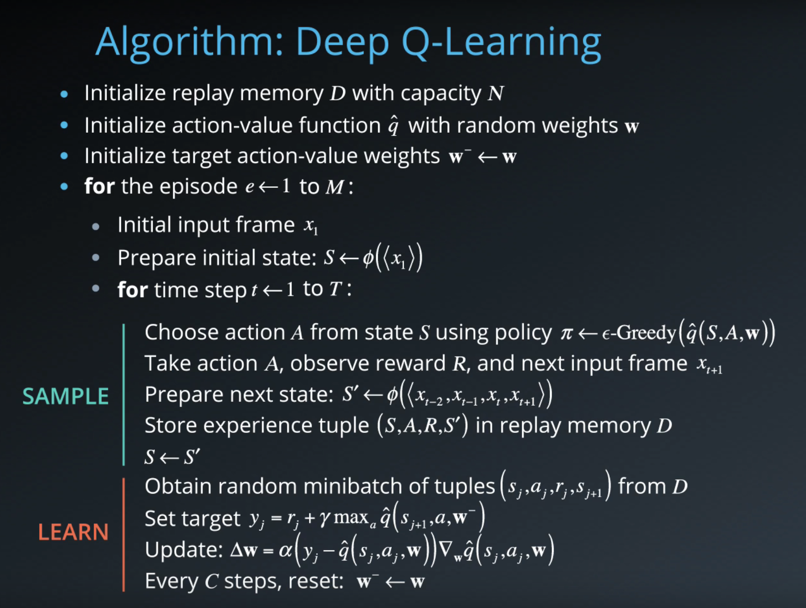
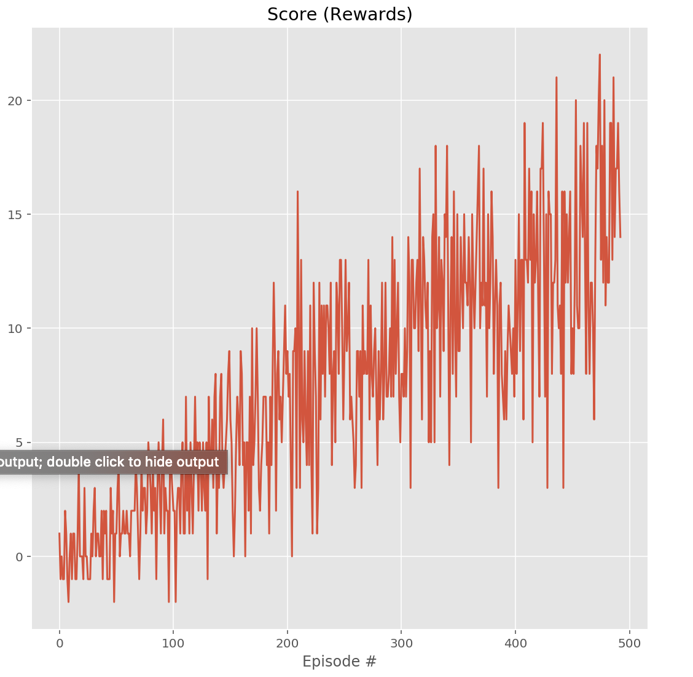

# Navigation Project

This report describes the author's approach to solve the Navigation project part of Udacity's [Deep Reinforcement Learning Nanodegree](https://www.udacity.com/course/deep-reinforcement-learning-nanodegree--nd893)

## Project and Environment details

For a detailed description of the project and the environment required to run the files provided, see README.md 


## Agent Implementation

### Theory

This project was solved by implementing the Value Based method "Deep Q-Networks". For reference, the original paper can be found [here](https://deepmind.com/research/dqn/). 
In short, Deep-Q Learning develops the traditional Q-Learning approach originally used in Reinforcement Learning (sometimes known as SARSA-max), by substituting the Q-table with a deep neural network that aims to approximate the Q-table. This particular implementation makes use of two specific techiques to aid training, namely "Fixed Q-Targets" and "Experience Replay". As described in the original paper, the former uses an "iterative update that adjusts the action-values towards target values that are only periodically updated, thereby reducing correlations with the target", whereas the later is "a biologically inspired mechanism termed experience replay that randomizes over the data, thereby removing correlations in the observation sequence and smoothing over changes in the data distribution". Altogether, these techniques contribute to reduce instability during the training process. 


### Algorithm



The figure above belongs to the lessons in the DRL Nanodegree.

### Implementation

The code consists of the following files:
- Navigation-DQN.ipynb : this is a Jupyter notebook which imports the required dependencies, initializes the environment, performs the training and plots the results. 
- model.py : the model is implemented as a Deep Neural Network using PyTorch. The size of the input layer is defined by the parameter 'state_size', followed by 2 hidden fully connected layers (each consisting of 1024 nodes), followed by an output layer with size controlled by the parameter 'action_size'. 
- dqn_agent.py : this file contains two classes, the DQN Agent itself and the Replay Buffer. The DQN Agent class includes several methods, amongst which there is an act() method which returns the action for an input state as per the current policy (an Epsilon-greedy selection is implemented in the policy). The method learn() updates the value parameters of the neural network for a given batch of experiences. The Replay Buffer class sotres the experience tuples using a fixed-size buffer. 


### Parameters and Results

The following are the hyperparameters used by the DQN Agent

```
BUFFER_SIZE = int(1e5)  # replay buffer size
BATCH_SIZE = 64         # minibatch size 
GAMMA = 0.99           # discount factor 
TAU = 1e-3              # for soft update of target parameters
LR = 5e-4               # learning rate 
UPDATE_EVERY = 4        # how often to update the network
```

For this particular case (number of states and actions in the environmet), the DQN uses the following architecture :

```
Input nodes (37),
Fully Connected Layer (1024 nodes, ReLu activation function),
Fully Connected Layer (1024 nodes, ReLu activation function),
Ouput nodes (4)
```

The DQN is trained with a learning rate LR=5e-4 and using a batch size BATCH_SIZE=64

Given the aforementioned parameters and architecture, these are the results obtained for one of the training sessions by training locally (CPU only). The training time varied between 10-14 minutes. 



**These results meets the project's expectation as the agent is able to receive an average reward (over 100 episodes) of at least +13, and in 1023 episodes only** (In comparison, according to Udacity's solution code for the project, their agent was benchmarked to be able to solve the project in fewer than 1800 episodes)

The project is solved in 427 episodes. These results exceed the benchmark provided of solving the project in less than1800 episodes (the project is considered solved if an average reward of >13 is obtained over 100 episodes). 

### Ideas for future work

There are multiple approaches to implement for future work. On the one hand, the approach to evaluating the environment could be modified by training the model on the pixels of the image observed by the agent instead of the state consisting of ray-based description of the surroundings (as suggested in the DRL course). 

Alternatively, the architecture of the neural network used to solve the project could be improved. A Double DQN should improve the performance by avoiding the overestimation of the action values usually suffered by a single DQN. Moreover, a Dueling DQN architecture would allow for generalization of the learning process, by implementing a model-free reinforcement learning approach in which the state value function and the action value function are simultaneously estimated by two DQNs. 
Other improvements to the learning process of the agent could be to implement Prioritized Experience Replay, which would allow for smoother and more efficient learning by prioritizing the most important transitions in the replay buffer. 
